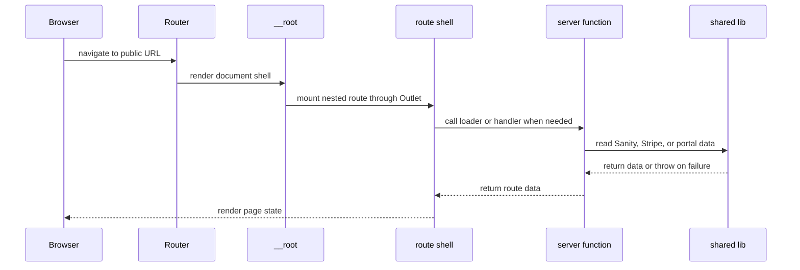
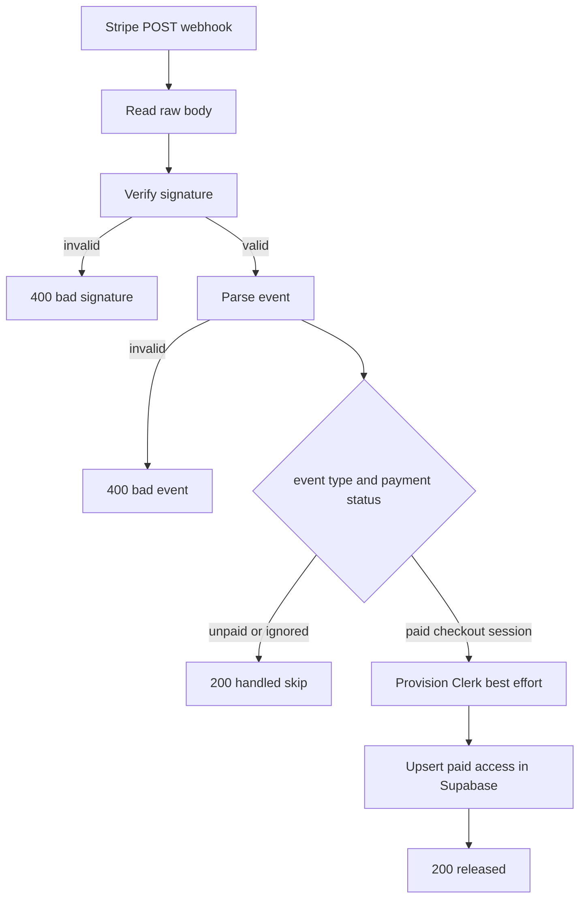

# System Map

This app is a TanStack Start application with a small number of public surfaces and a handful of server-only data paths. The important architectural idea is that the visible routes are thin shells over shared libraries, while the actual stateful work lives in server functions and route handlers.

The runtime is split across three layers:

- **Client route shells** in `src/routes/*.tsx` render pages, declare metadata, and compose shared UI.
- **Server entrypoints** in `src/start.ts` and `src/server.ts` install middleware, SSR behavior, and request normalization.
- **Shared libraries** under `src/lib/**` own the real data access and business rules for Sanity, Stripe, and the client portal.

## Runtime boundaries

The app is built on `@tanstack/react-start` and `@tanstack/react-router`, with `createServerFn` used where code must run only on the server. `src/router.tsx` creates the router with a `QueryClient` in context, enables scroll restoration, and preloads with zero stale time. `src/routes/__root.tsx` is the root document shell: it provides the HTML skeleton, loads global CSS, wraps the app in `ClerkProvider` and `QueryClientProvider`, renders the persistent site header and footer, and defines root-level 404 and error behavior.

Because the root route owns the shell, every nested route depends on `<Outlet />` being present. The route tree tests explicitly guard this coupling, because removing the outlet would make child routes disappear even though the route files still exist.

The shell also wires error reporting. `src/routes/__root.tsx` reports route errors through `reportLovableError`, and `src/server.ts` adds a server-side normalization step so catastrophic SSR failures still return a branded HTML error page.

## Request handling and middleware

`src/start.ts` owns request middleware order. It installs an outer error middleware, then Clerk authentication only when `CLERK_SECRET_KEY` is present, then CSRF protection for server functions. This conditional auth is non-obvious but important: a missing Clerk secret disables auth entirely instead of taking down public pages. The start tests pin that contract.

This means authentication is runtime-configured, not compile-time fixed. Public pages continue to serve without session support, while signed-in flows only become active when the environment is configured.

`src/server.ts` is the actual server entrypoint. It lazily loads the TanStack Start server handler, special-cases `/about` to permanently redirect to `/who-we-are` for GET and HEAD, and then post-processes the response. If h3 swallowed an SSR throw into a JSON 500 body, the server replaces it with the app’s HTML error page. After that, it upgrades deliberately marked degraded responses to 503 so upstream outages can carry `Retry-After` semantics.

## Public routes and their roles

### Homepage: `src/routes/index.tsx`

The homepage is the only route that intentionally catches Sanity outages. It loads featured episodes through `loadFeaturedEpisodes(fetchEpisodeList, 39)` and absorbs only the case where Sanity is unreachable. Everything else re-throws so real bugs still fail loudly.

This asymmetry matters because the homepage is mostly static. If its podcast section failed the same way as the directory, the entire front door could become a 500 even though the rest of the page is still valid. The loader therefore returns `podcastUnavailable` when Sanity is down and the page renders an honest fallback state.

The homepage also demonstrates a coupling that is easy to miss: it does not call the Sanity server function directly in an inline testable branch. Instead, the route delegates to `loadFeaturedEpisodes`, because route loaders that depend on server functions are hard to invoke safely in tests unless the decision logic is extracted.

### Podcast directory: `src/routes/podcast.tsx`

The podcast directory is a strict server-failure surface. Its loader does **not** catch Sanity failures; if `fetchEpisodeList` fails, the route should error so the page can say it is temporarily unavailable rather than pretending the catalogue is empty.

The route also sets response headers only for errored matches. It emits `retry-after` and `x-podcast-source: degraded` so the server can later upgrade that 500 to a 503. This is a deliberate coordination point between the route and `src/lib/podcast/degraded-status.ts`: the route brands the outage, and the server entrypoint turns that brand into crawl-friendly retry semantics.

The page’s browsing model is client-side. It takes the full episode list already loaded by the server, adapts it into browsable rows, and filters/sorts in memory with `browseEpisodes`. That is a performance and correctness choice: no request round-trip is needed per keystroke, and the route remains the owner of archive pagination behavior on mobile and desktop.

### Podcast episode routes

The route tree tests show that the episode detail route is mounted as `/podcast_/$slug`, not nested under `/podcast`. That underscore escape is an architectural safeguard: `src/routes/podcast.tsx` is a leaf route and does not render an outlet, so a nested `podcast/$slug` would never appear. The generated route tree is tested as source text because that is where accidental renames or nesting regressions would show up first.

### Client portal: `src/routes/portal.tsx`

The signed-in client portal is private by default. Its loader comes from `fetchPortalPage`, which uses Clerk auth and a Supabase-backed scoped read to load only the reports the current session is allowed to see. The route itself never handles a client id; it only receives the already-authorized reports list from the server function.

This route is also intentionally non-indexable. It sets `noindex` in both document metadata and `X-Robots-Tag`, so the privacy rule is enforced whether the page is rendered server-side or observed by crawlers.

## Server-side business boundaries

### Podcast data access

`src/lib/podcast/queries.ts` is the single module for Sanity reads. It exports plain async functions for server-only callers and `createServerFn` wrappers for route loaders. That split is not cosmetic: a bare route loader can execute in the browser during client-side navigation, which would force browser-side cross-origin requests to Sanity and introduce an external CORS dependency. The wrappers keep Sanity fetches on the server.

The module also owns the query shapes and the slug validator. The validator is a boundary check, not the injection guard; the actual injection safety comes from parameterized GROQ queries.

### Stripe fulfillment

`src/routes/api/stripe-webhook.ts` is a thin route handler over `src/lib/billing/stripe-webhooks.ts`. The route reads the raw request body, verifies the Stripe signature against `STRIPE_WEBHOOK_SECRET`, parses the event, and routes verified events to the shared webhook module.

The shared module does the real fulfillment work. It only releases paid access for `checkout.session.completed` and `checkout.session.async_payment_succeeded`, skips unpaid sessions, and treats `checkout.session.async_payment_failed` as a handled failure event rather than a transport error. When a paid event includes a usable email, it best-effort provisions or resolves a Clerk user before releasing access, but provisioning failures do not block the unlock.

The unlock itself is an idempotent Supabase upsert on `client_id`. That means a replayed Stripe event writes the same state again instead of duplicating content, and a payment can succeed before the report is staged without losing the entitlement record.

### Client portal data access

`src/lib/client-portal/portal.ts` is the data gate for the signed-in portal. It first asks Clerk for the current auth state, then redirects unauthenticated users to sign-in before any report fetch occurs. If the user is signed in, it reads the Clerk token and uses it to fetch only the Supabase rows authorized by RLS.

That coupling is subtle: the route is private not because the UI hides content, but because the server function refuses to assemble a page without a valid auth token. The page component itself is just a renderer for the authorized reports list.

## Configuration and operational invariants

The app depends on a small number of environment variables and runtime contracts:

- `CLERK_SECRET_KEY` enables Clerk middleware in `src/start.ts`.
- `STRIPE_WEBHOOK_SECRET` is required for webhook verification in `src/routes/api/stripe-webhook.ts`.
- Supabase and portal configuration are read by the shared billing and portal libraries, not by the route shells.
- The server entrypoint treats branded degraded responses specially so temporary upstream outages can return `503` with `Retry-After`.

The main operational invariant is that public pages must not fail because auth is missing. That is why Clerk middleware is conditional, why homepage podcast loading degrades only narrowly, and why the server entrypoint normalizes only the cases that are truly infrastructure-related.

## Studio package

`studio/package.json` defines a separate Sanity Studio app. It has its own build, deploy, GraphQL deploy, dev, and start scripts, and its own React/Sanity dependencies. This is a distinct authoring surface, not part of the runtime app shell, but it is coupled to the app through the Sanity content model and queries consumed by `src/lib/podcast/queries.ts`.

## Focused tests that matter

The repository’s tests document the architecture as much as they verify it:

- `src/start.test.ts` pins the rule that auth middleware is off when Clerk is not configured.
- `src/routes/index.test.ts` asserts the homepage catches only Sanity outages and rethrows real bugs.
- `src/routes/podcast.test.ts` asserts the directory does not catch loader errors and that degraded matches emit the headers the server upgrade logic expects.
- `src/routes/c.$token.test.ts` asserts the private token route is unindexable and only resolved through the server function.
- `src/lib/route-shape.test.ts` checks that the generated route tree and the declared public surfaces stay aligned, catching route renames and nesting mistakes.
- `src/lib/billing/stripe-webhooks.test.ts`, `src/lib/client-portal/portal.test.ts`, and the podcast query tests pin the server-side business rules the routes depend on.

Together these tests define the safe change boundaries: route files stay thin, server functions own the data policy, and the request pipeline is where auth, CSRF, and SSR normalization are enforced.
