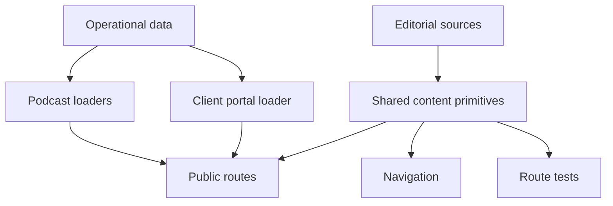

# Content Model and Public Surfaces

This page describes the public-facing content model that routes, navigation, and tests rely on. The key distinction in this repository is between **editorial surfaces** — the pages that make up the site’s public brand and marketing journey — and **operational surfaces** — the podcast feed, the client portal, and the data connectors that power them.

The editorial model is not assembled ad hoc in route files. Shared modules define the canonical navigation, surface list, brand text, and page-level content primitives, and the route tests assert that those definitions stay aligned with the generated router.

This diagram shows how editorial definitions and operational data feed the public UI through different paths.

## The main editorial surfaces

The site’s public editorial navigation is defined in `src/lib/nav.ts`. It contains seven top-level destinations, in this order:

1. `Why We Exist` → `/why-we-exist`
2. `Who We Are` → `/who-we-are`
3. `The New Human Era` → `/the-new-human-era`
4. `The Human Archive` → `/the-human-archive`
5. `Podcast` → `/podcast`
6. `Contact` → `/contact`
7. `Blueprint` → `/be-human-ai`

`Blueprint` is the only CTA-styled item, but it is still a direct navigation target rather than a nested menu item. The old dropdown-parent shape is gone; tests now expect the bar to be flat.

`src/lib/surfaces.ts` is the broader public-surface registry. It includes the editorial pages above, plus machine and dynamic surfaces such as `sitemap.xml`, `/api/stripe-webhook`, `/podcast/$slug`, `/c/$token`, the Clerk auth routes, and `/portal`. The route-shape test treats this registry as authoritative and checks that it matches the generated router exactly.

## Editorial content primitives

The repository keeps repeated editorial copy in shared data and constants instead of duplicating it across routes:

- `src/lib/brand.ts` stores the site’s brand-facing content such as `SERVICES`, `PRINCIPLE_TITLES`, `HOME_PRINCIPLES`, and the Human Archive data.
- `src/lib/nav.ts` stores the canonical public navigation labels and destinations.
- `src/lib/surfaces.ts` stores the public route inventory and sitemap eligibility.
- `content/topic-taxonomy.json` provides the topic vocabulary used by podcast content.
- `content/clients.json` provides client fixture data for the portal and report publishing flow.

These files are not just convenience copies. They are the shared source of truth for the public experience, and tests intentionally read from them instead of rebuilding the same lists in multiple places.

## Editorial versus operational data

The repository treats some content as editorial and some as operational:

- **Editorial content** is the public brand and marketing material: navigation labels, homepage principles, archive entries, service descriptions, and the surface list for the site.
- **Operational content** is data that powers authenticated or generated experiences: podcast episode records, featured episode selection, client portal reports, token-scoped access, and webhook fulfillment.

That split matters because the public pages are mostly stable brand surfaces, while the operational content changes from external data sources or authenticated state. For example, the homepage uses `loadFeaturedEpisodes` to show featured podcast content, but it degrades narrowly when Sanity is unreachable so the front door remains usable. The podcast directory and episode routes do not swallow those failures; they surface them as real errors. Likewise, the portal loader requires a valid Clerk session token and only then reads the Supabase-scoped report data.

## How content maps to journeys

The public site is arranged around a few user journeys:

- **Brand and positioning**: `/why-we-exist`, `/who-we-are`, and `/the-new-human-era` establish the company’s point of view.
- **Portfolio and archive**: `/the-human-archive` and its shared archive data present the human-centered examples the site highlights.
- **Podcast discovery**: `/podcast` lists the feed-backed episode catalogue, while `/podcast/$slug` serves individual episode detail pages.
- **Contact and conversion**: `/contact` captures inbound interest, and `/be-human-ai` acts as the CTA surface.
- **Client access**: `/portal` is private and shows authorized reports only.

The route-shape test is the safety net that keeps those journeys intact. It asserts that every route in the generated router is represented in `SURFACES`, that every declared surface still routes, and that no page surface opts out of the single-nav rule.

## Shared invariants the tests rely on

Several invariants are important enough that tests pin them directly:

- The top navigation is flat, ordered, and contains exactly the seven public destinations above.
- The public surface list matches the generated router; route additions and renames must be reflected there.
- All page surfaces render the single site nav; there is no remaining page-level exemption.
- The homepage can degrade only for unreachable Sanity, not for unrelated bugs.
- The podcast directory and episode routes must fail loudly on loader errors so outages are visible.
- The portal must not fake emptiness when a signed-in session is broken; missing token or config is an error, while a legitimate zero-report account is an empty success.

These invariants are what let the rest of the repository treat content as structured state instead of loosely coupled page text.

## Extension points

When extending the site, the safest change path is to update the shared primitive first and let routes consume it:

- Add or rename a public page in `src/lib/surfaces.ts`, then update the router and the route-shape test together.
- Add or rename a navigation destination in `src/lib/nav.ts`, then verify it still resolves in the router.
- Update brand copy in `src/lib/brand.ts` rather than embedding the same text in multiple route components.
- Update topic vocabulary in `content/topic-taxonomy.json` and the podcast model together, since episode metadata depends on that taxonomy.
- Treat portal and podcast data changes as operational changes, because they affect authenticated reads and external syncs rather than static brand text.

The point of the model is consistency: routes should render shared content primitives, and tests should fail when a route drifts away from the primitive it is supposed to use.
