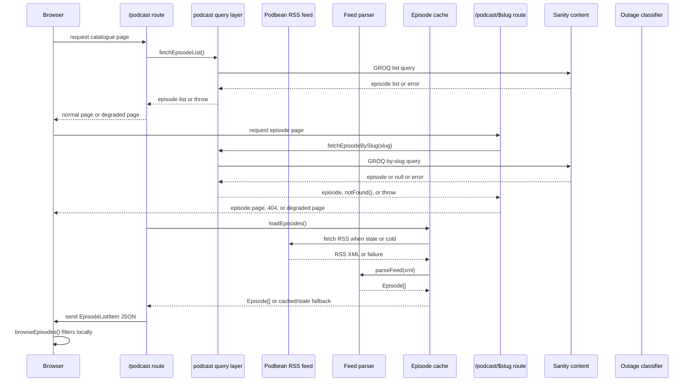
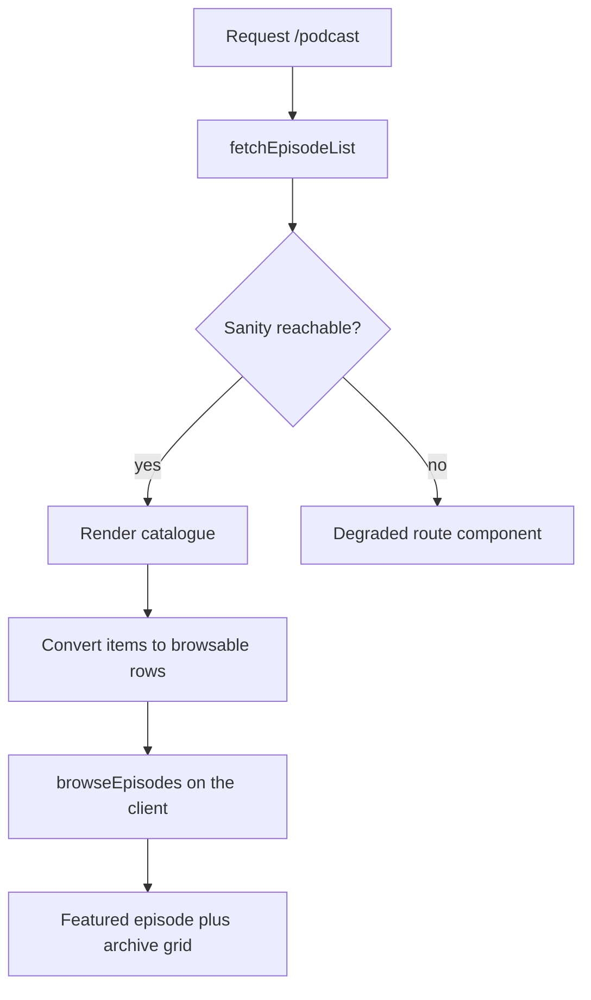

# Podbean Podcast Sync

The Podbean integration is the ingestion path that turns the public Podbean RSS feed into the episode catalogue used by the podcast landing page and per-episode routes. It is intentionally split into small, testable pieces:

- `src/lib/podbean/feed.ts` owns the upstream fetch, memoisation, and failure fallback.
- `src/lib/podbean/parse.ts` turns raw RSS into stable episode objects and derived display fields.
- `src/lib/podbean/filter.ts` applies client-side browse/search controls over the already-loaded catalogue.
- `src/lib/podcast/sync.ts` prepares Sanity draft-creation plans from feed items.
- `src/lib/podcast/outage.ts` separates missing content from true upstream failure.
- `src/routes/podcast.tsx` and `src/routes/podcast_.$slug.tsx` consume those library boundaries and render either normal content or degraded states.

The result is a feed-driven site that can keep rendering from cached or last-good data, while still distinguishing a real missing episode from an outage.

## End-to-end flow

This diagram shows the two different data sources involved in the feature:

1. the public Podbean feed, which supplies the canonical episode catalogue for browse and sync planning, and
2. the Sanity content queries, which supply the published site content for the episode detail pages.

## Feed ingestion and caching

`src/lib/podbean/feed.ts` is the server-only entrypoint for feed loading. It fetches the public RSS URL with an XML-oriented Accept header and a timeout, then passes the response body to `parseFeed()`.

Important behavior:

- The feed URL is public and requires no credentials.
- The module keeps a process-local cache with a 15 minute TTL.
- Concurrent cold requests share one in-flight fetch instead of each fetching and parsing the feed separately.
- If the fetch fails, the response is non-OK, or parsing yields zero episodes, the loader serves the last good cached list when available.
- Failures are not cached; the next request retries.
- `getEpisodes` is a server function that returns the browsable listing shape to routes, keeping XML parsing off the browser.

That design means the catalogue page can still render with stale-but-valid content during transient upstream problems, and can fall back to an empty state only when there is no previously cached episode list.

## Parsing and normalisation

`src/lib/podbean/parse.ts` is the shape-stabilisation layer. It handles the Podbean XML feed and converts each usable `<item>` into a typed episode record with derived fields ready for display.

What it does:

- decodes named and numeric HTML entities that appear in the feed,
- strips markup down to plain text for safe rendering in React text nodes,
- extracts a short excerpt from verbose show notes,
- parses guest names from titles when the title structure is recognisable,
- formats integer duration seconds into human-readable minute/hour labels,
- selects the featured subset used by the homepage.

The parser is intentionally defensive:

- bad entities are ignored rather than crashing the whole catalogue,
- items missing required fields are skipped rather than partially emitted,
- unparseable guest names return `undefined` rather than a wrong name,
- duration strings that are not plain seconds are rejected rather than misread.

The key invariant is that the output is safe, display-oriented data, not raw feed HTML. `stripHtml()` is explicitly not a sanitizer; its only safe destination is React text.

## Browse, search, and list behaviour

`src/lib/podbean/filter.ts` defines the browse state used by the catalogue page.

The browse model is deliberately small:

- search query
- duration bucket
- sort order

It does not include topic or date filtering because the feed does not carry the data needed to make those controls meaningful.

Filtering behavior:

- search is accent-insensitive and case-insensitive,
- query terms are ANDed together,
- search matches across title, guest, excerpt, and episode number text,
- duration buckets are applied after search,
- sorting is newest-first by default, with an explicit oldest-first mode.

`browseEpisodes()` never mutates the input array. `durationCounts()` computes live option counts for the current search query so the UI can show how many results each bucket would yield.

## Catalogue route behavior

`src/routes/podcast.tsx` is the catalogue surface. It loads the episode list, converts it to a browsable structure, and applies client-side filters for search and sorting.

The page keeps browse interactions local to the browser because the catalogue is already loaded in memory. That avoids a network round-trip per keystroke and keeps filtering responsive.

If the upstream content source fails, the route uses a degraded component and emits degraded response headers so the failure is visible as a temporary outage rather than as an empty catalogue.

## Episode route behavior

`src/routes/podcast_.$slug.tsx` renders individual episode pages and treats three outcomes differently:

- found: render the episode normally,
- not found: return a real 404,
- unreachable: surface a degraded outage state.

That distinction matters because a missing slug and an upstream failure are not the same thing. A genuine 404 is a permanent statement about that URL; an outage is temporary and must not be cached or interpreted as a missing episode.

The route loader:

1. queries the episode by slug,
2. throws `notFound()` when the query returns no episode,
3. applies content corrections when an episode exists,
4. fetches related candidates,
5. derives related episodes for the sidebar or lower-page content.

The route header logic only adds degraded headers when the loader actually errored, not when it returned `notFound()`. That preserves the difference between a missing page and an outage.

## Failure handling and degraded states

`src/lib/podcast/outage.ts` is the classifier that keeps 404s and upstream failures separate.

It treats a `SanityHttpError` as an upstream outage, and also recognises the same outage when the error has crossed an RPC boundary and lost its prototype. It does not classify `notFound()` as an outage.

That classification is used by the podcast routes to decide whether they should:

- render content,
- render a true 404,
- or render the branded degraded page with retry-after metadata.

This is the main safety invariant of the integration: a missing episode must never be disguised as an outage, and a real outage must never be turned into a 404.

## Sync planning for Studio and backfill

`src/lib/podcast/sync.ts` bridges the public feed to Sanity draft creation.

The sync logic has two related responsibilities:

- `buildSeedDocuments()` prepares backfill-shaped episode documents from feed items and slug proposals.
- `planSyncDrafts()` decides which new drafts should be created from the current feed and the set of existing Sanity document ids.

The sync plan is intentionally conservative:

- it probes both the published id and the draft id for each feed guid,
- it refuses to create anything if two guids collapse to the same document id,
- it records duplicate guids once and creates them once,
- it stamps new Studio-created drafts with a distinct provenance marker,
- it keeps slug generation out of the sync payload so the URL remains a human decision.

That means the Studio button can safely create drafts for unseen episodes without creating phantom drafts for already-published content.

## Why the pieces are separated

The integration is split along ownership boundaries rather than UI boundaries:

- feed fetch and caching live in one module,
- text extraction and display shaping live in another,
- browse logic is pure and reusable on the client,
- sync planning is pure so it can be tested without the Studio shell,
- outage classification is isolated so 404s and transport failures do not drift together,
- routes only orchestrate those library pieces.

This makes the system resilient in two ways:

1. operationally, because stale last-good catalogue data can outlive transient feed failure, and
2. semantically, because each failure mode is handled as the thing it is, not as a generic empty result.

## Tests that matter

The repository’s focused tests verify the behaviours that protect this integration most:

- parser tests prove entity decoding, excerpting, guest extraction, and item skipping,
- live feed tests assert the real feed still parses and that browse/search assumptions remain true,
- filter tests pin the browse/search normalization and duration bucketing,
- sync tests ensure new drafts are planned correctly and collisions are rejected,
- outage tests ensure 404 and outage classification never collapse into one another,
- query tests ensure the content routes distinguish null results from transport failures.

Those tests matter because they lock the main promises of the integration: stable ingestion, safe normalisation, truthful routing, and graceful degradation.
