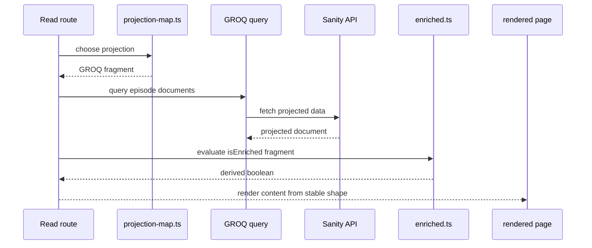
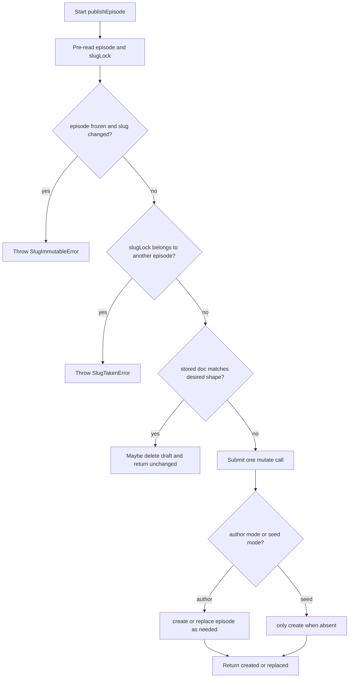

# Sanity and Content Models

This page documents the Sanity-backed content path for episodes: how the repository pins the Sanity connection, how content is projected and enriched for reads, and how publish-time code prevents schema drift and slug races.

The key idea is that Sanity is used in two distinct ways:

- as the published content source that routes and queries read from, and
- as the authoring/publish surface in Studio, where schema rules and transaction logic prevent accidental changes to permanent URLs and content shape.

## Boundary and configuration model

`src/lib/sanity/config.ts` is the single place where the Sanity deployment constants live. It pins the project id, dataset, API version, query host, mutate host, image host, and site origin. The file’s own comments make the boundary explicit: these are not secrets, and the write token is intentionally not stored there.

Two invariants matter operationally:

- `SANITY_API_VERSION` is pinned to a fixed date so query behavior does not drift silently.
- `GET_URL_LIMIT` is set below Sanity’s documented GET ceiling so long GROQ queries switch to POST before they can hit a 414 in production.

`SITE_ORIGIN` is intentionally constant, not environment-driven, because every canonical URL, Open Graph URL, and sitemap entry must resolve to the same public origin.

`studio/package.json` shows that the Studio is a separate Sanity app shell with its own `sanity` scripts and dependencies. That separation keeps the Studio toolchain and the read-side app from sharing a hidden runtime boundary by accident.

## Read path: projection, enrichment, and query shape

The read path does not query arbitrary document shapes. Instead, `src/lib/sanity/projection-map.ts` defines the alias-to-source map for episode reads, and `project()` turns that map into GROQ projection syntax.

The important property is that the projection map is the source of truth for field wiring. Tests pin the exact alias/source pairs so that a same-typed swap such as `podbeanUrl` and `audioUrl` fails fast. The projection code also keeps some fields as whole objects and others as leaf refs on purpose:

- `slug` stays as the full slug object because callers read `.current` themselves.
- `topics` dereferences references and keeps only `_id` and `name`.
- image fields project to `asset._ref`, which is the shape the read path actually needs.

The list projection is intentionally narrower than the full projection. That is an operational safeguard against payload bloat and against accidentally shipping fields that the catalogue page does not render.

`src/lib/sanity/enriched.ts` defines `IS_ENRICHED_FRAGMENT`, a GROQ predicate rather than a stored boolean. The decision here is important: enrichment is derived on every read from actual document content, so there is no stored flag that can drift out of sync with the document.

The enrichment predicate checks two things only:

- `guestPhoto.asset._ref` is defined, and
- `guestBio` has non-zero length.

The corresponding test evaluates the real GROQ fragment, not a JavaScript mirror. That matters because GROQ’s truthiness and `length()` semantics are part of the contract, including the documented edge case where whitespace-only bios still count as enriched unless Studio validation prevents them.

`src/lib/sanity/groq-eval.ts` and the projection tests are the guardrails that keep the source map and the generated GROQ aligned. The tests evaluate the real fragment against real fixtures so a change in the map or fragment fails for the same reason the production query would fail.

## Projection and enrichment flow

This flow matters because read-time shape is a contract, not a convenience. The projection decides what fields are available, and the enrichment fragment decides whether the document counts as complete content.

## Publish path: transaction semantics and failure boundaries

`src/lib/sanity/publish.ts` is the critical write-side module. It is built around one rule: publication must be safe even when two writers race, and it must not rewrite a permanent URL after first publish.

The publish code enforces that rule with two compare-and-set checks in one transaction:

- a slug lock document (`slugLock-<slug>`) that prevents two different episodes from claiming the same slug, and
- a strict `create` of the episode document itself when the pre-read shows the episode does not yet exist.

The publish tests show why both pieces are required. The slug lock prevents slug collisions, but the episode-side strict `create` is what prevents two sessions from creating the same unpublished episode under different slugs at the same time. Both mutations must travel together in one `mutate()` call; splitting them would remove the all-or-nothing guarantee.

The module distinguishes three major outcomes:

- `created` when the transaction creates a new episode,
- `replaced` when an authored episode is updated in place, and
- `unchanged` when the desired document already matches what is stored.

That last branch is important for backfill safety. Seed mode intentionally avoids emitting an episode mutation against an existing document, so rerunning a backfill cannot overwrite enrichment or author edits.

`strip()` removes only a fixed set of Sanity system keys before comparing documents. It keeps `_id`, `_type`, `_ref`, and `_weak`, but removes revision and timestamp metadata. That invariant prevents spurious republish loops caused by unstable metadata.

`equal()` performs structural deep equality rather than JSON string comparison. Objects are compared by key set and value, arrays are compared in order, and the ordering rule matters because GROQ arrays are ordered content, not unordered sets.

The transaction builder also recomputes `searchText` and deterministically keys topic references before publish. That keeps the stored document in sync with the client-side search haystack and avoids nondeterministic `_key` values in arrays.

## Publish control flow

The main failure semantics are:

- a frozen slug is immutable after first publish,
- a slug already owned by another episode raises `SlugTakenError`, and
- a real `409 Conflict` from the strict create is translated into `PublishConflictError`.

`src/lib/sanity/client-errors.ts` is part of that boundary. `normalizeSanityError()` converts `@sanity/client` errors with numeric `statusCode` values into the internal `SanityHttpError` shape used by publish arbitration. That translation is duck-typed on `statusCode`, not `instanceof`, so duplicated installs or mismatched package copies do not break conflict detection.

The resulting invariant is strong: a genuine 409 can be retried as a race, while transport failures, auth failures, and 5xx responses are left untouched and are not mislabeled as publish conflicts.

## Schema and Studio contract

The schema contract tests tie the read-side projection back to the Studio schema. That is the anti-drift mechanism for the content model:

- every field needed by the read path must exist in the schema with the expected type,
- every schema field must either be projected or be explicitly excluded with a reason, and
- fields such as `guid`, `slug`, `searchText`, and the image fields are pinned with their intended readOnly or validation behavior.

This is what stops a Studio rename from silently blanking content on the website. A field added in Studio but not surfaced in the projection is treated as a test failure, not as a harmless omission.

The Studio config tests also ensure infrastructure types stay out of the authoring UI. `slugLock` is excluded from the sidebar, from the “Create new” menu, and from document actions. That matches its role as a mutex document written only by publish transactions.

The same config file also appends the custom `Sync from Podbean` action to episode documents only, leaving other schema types untouched. The action wiring matters because the publish/sync boundary is intentionally narrow: the sync action can prepare drafts from Podbean feed data, but it must not itself publish content.

## Operations and failure expectations

The configuration and tests together establish the following operational expectations:

- reads use a pinned Sanity API version and a conservative GET/POST threshold,
- writes go to the non-CDN Sanity host,
- published URLs are anchored to one canonical site origin,
- `guestBio` enrichment is derived, not stored,
- projection changes are intentionally explicit and test-backed,
- publish transactions are all-or-nothing and guard permanent slug ownership,
- schema changes in Studio are treated as API changes for the site.

These are the boundaries that matter when extending the content model. If a new field is added, it must be reflected in the schema contract, the projection map, and any publish-time recomputation that depends on it. If a publish rule changes, the transaction tests need to prove that the safety invariant still holds.

## Focused tests that protect this system

The tests that matter most for this integration are:

- `src/lib/sanity/schema.contract.test.ts` for schema/projection drift and readOnly expectations,
- `src/lib/sanity/projection-map.test.ts` for alias wiring and GROQ evaluation,
- `src/lib/sanity/enriched.test.ts` for the derived enrichment predicate,
- `src/lib/sanity/publish.test.ts` for transaction shape, conflict handling, and frozen slug behavior,
- `src/lib/sanity/studio-config.test.ts` for Studio gating and custom action wiring,
- `src/lib/sanity/studio-publish-deps.test.ts` and `src/lib/sanity/transport.test.ts` for the supporting write-path boundaries.

Together, they make the content model changeable without becoming fragile: the projection, enrichment, and publish layers can evolve, but only if the tests continue to prove that the site still reads the right fields, derives the right completeness signal, and publishes with the right safety checks.
