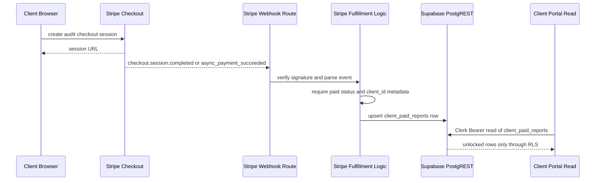
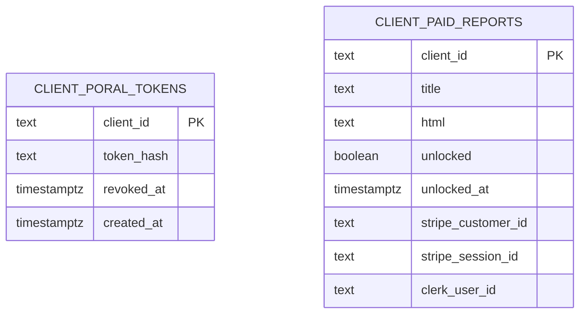

# Stripe and Portal Access

This page documents the end-to-end path from audit checkout to portal exposure.
It covers the Stripe checkout session, webhook verification and fulfillment, the
paid-report table, and the Clerk-scoped read path that surfaces unlocked content
in the private client portal.

The system uses two separate access-control surfaces:

- **Magic-link token access** for the private client portal page itself, backed
  by `client_portal_tokens` and the token lookup path.
- **Clerk-authenticated access** for the paid reports tab, backed by
  `client_paid_reports` and Supabase RLS.

Stripe only drives fulfillment. The webhook is the boundary that turns a paid
Checkout session into persisted unlock state; the portal reads then render that
state only when the database and auth rules allow it.

## Overview

This shows the payment-to-persistence-to-portal chain. Checkout does not unlock
content directly; the webhook does.

## Checkout session creation

`createAuditCheckoutSession` builds the one-time audit payment session using the
Stripe REST API wrapper in `src/lib/billing/stripe-client.ts`.

Key behavior:

- The session is created with `mode: "payment"` and a single line item using
  `STRIPE_AUDIT_PRICE_ID`.
- `clientId` is carried in `metadata[client_id]` so fulfillment can map the paid
  session back to the correct client row.
- `managed_payments[enabled]` is set to `true` and the call uses the preview
  Stripe version header isolated in `STRIPE_PREVIEW_VERSION`.
- `success_url` and `cancel_url` are canonicalized to the production origin in
  `audit-checkout.ts`; the success page is only a receipt, not the unlock.
- `stripeConfigFromEnv()` fails closed if `STRIPE_SECRET_KEY` is absent.

The Stripe client wrapper itself is intentionally minimal: it performs a single
form-encoded POST, attaches the secret key via HTTP Basic auth, and throws a
`StripeApiError` when Stripe responds with a non-OK status or a payload-level
error.

## Webhook verification and routing

`src/routes/api/stripe-webhook.ts` is the HTTP entrypoint. It reads the raw
request body, verifies the `Stripe-Signature` header, parses the event, and then
hands the verified event to `routeWebhookEvent`.

Important status behavior:

- **500** when `STRIPE_WEBHOOK_SECRET` is missing or the handler throws.
- **400** when the signature is invalid or the event body cannot be parsed.
- **200** for verified outcomes, including skips such as an unpaid completed
  session or an ignored event type.

That status split is deliberate because Stripe retries non-2xx deliveries. A
forged or malformed payload should not be retried, while a transport or handler
failure should be.

The verifier in `stripe-webhooks.ts` uses WebCrypto HMAC verification with a
300-second tolerance window. It accepts any matching `v1=` signature value in a
rotation header, which makes secret rotation safe without special-case route
logic.

## Fulfillment logic

`routeWebhookEvent` handles the event semantics after signature verification.
The implementation is intentionally narrow:

- It only reacts to `checkout.session.completed` and
  `checkout.session.async_payment_succeeded`.
- `checkout.session.async_payment_failed` is treated as a handled failure event,
  not a system error.
- Any other event type is ignored.
- Only sessions with `payment_status === "paid"` trigger fulfillment.
- `metadata.client_id` is required; without it, the webhook reports
  `missing-client`.

For a paid session, the release record includes:

- `clientId`
- `stripeCustomerId`
- `stripeSessionId`
- payer email, if readable
- Clerk user id, if a provisioning seam can resolve one

### Clerk provisioning is best-effort

If a payer email is available, the webhook attempts to provision or resolve a
Clerk account before releasing access. That step is explicitly non-blocking:

- If provisioning is injected and returns `null`, the release still proceeds.
- If provisioning throws, the webhook logs a constant message and continues
  with `clerkUserId: null`.
- `customer_details.email` is preferred as the payer email; `customer_email`
  is the fallback.
- If neither field yields an email, provisioning is skipped entirely.

This preserves the core invariant: a paid session must unlock the report even if
identity linkage fails.

## Persistence boundary

Fulfillment writes to `public.client_paid_reports` through Supabase REST using
service-role credentials. The write path in `releasePaidAccess` performs an
upsert on `client_id` with `Prefer: resolution=merge-duplicates`.

The stored payload contains:

- `client_id`
- `unlocked: true`
- `unlocked_at`
- `stripe_customer_id`
- `stripe_session_id`
- `clerk_user_id`, only when a provisioning result exists

It does **not** write `title` or `html`. Content staging stays an operator
responsibility, and the webhook only marks the unlock.

This makes the release idempotent:

- repeated webhook deliveries merge into the same `client_id` row,
- the same payload can be written again safely,
- and a replay does not clobber a previously linked Clerk id with `null`.

If Supabase is misconfigured, the release path fails loudly before making a
request. If the REST write itself fails, the helper throws and the route returns
500, which allows Stripe to retry.

## Paid-report table and RLS

The `client_paid_reports` table is the storage owner for the paid unlock state.
The migration establishes the key invariants:

- `client_id` is the primary key.
- `title` and `html` are nullable so payment can arrive before content staging.
- `unlocked` defaults to `false`.
- There is no expiry or lifetime column; release ends by event, not by clock.
- Anonymous access is explicitly denied with RLS.

This diagram shows the two database owners relevant to access control: token
material for the private portal and paid unlock material for the report tab.
The paid-report table is what Stripe fulfillment writes.

### RLS for authenticated readers

`supabase/migrations/20260914000002_clerk_paid_reports_rls.sql` adds the select
policy for `authenticated` users:

- `auth.jwt()->>'sub' = clerk_user_id`
- `unlocked = true`

So the Clerk subject must match the stored `clerk_user_id`, and the row must be
unlocked before it is visible. The table is also indexed on `clerk_user_id` so
the policy remains a lookup rather than a scan as rows accumulate.

The important invariant is that the query layer does not invent identity. The
client sends its Clerk session token as a bearer credential, and Supabase RLS is
the only filter that decides which rows the user can see.

## Portal read exposure

`src/lib/client-portal/supabase-clerk.ts` fetches paid reports with the caller's
Clerk token in the `Authorization` header and the public anon key in `apikey`.
No `client_id` equality predicate is sent. That is intentional: the client does
not get to name its own rows; the database grants or denies them via RLS.

The read path also applies a render-completeness guard:

- the row must be an object with `client_id`, `title`, `html`, `unlocked`, and
  `unlocked_at`,
- `title` and `html` must both be non-empty,
- and `unlocked` must be `true`.

Malformed or incomplete rows are dropped instead of rendering a partial tab. A
403 or similar transport refusal throws status-only, causing the portal route to
fail closed rather than treating an outage as an empty account.

At the token-gated client page level, `tokens.ts` combines the token lookup and
paid-report fetch:

- the magic link still resolves the client page,
- `fetchPaidReport` is attempted only after the portal client is resolved,
- and paid-report lookup failure does not take down the already-earned page.

That means the token opens the private page, while Clerk and RLS govern whether
the paid tab is appended.

## Failure handling and idempotency

This integration is designed to fail closed and to tolerate retries.

### Failure handling

- Missing `STRIPE_SECRET_KEY`, `STRIPE_WEBHOOK_SECRET`, `SUPABASE_URL`, or the
  required Supabase keys fail loudly.
- Bad Stripe signatures and malformed events return 400.
- Webhook handler exceptions return 500 so Stripe can retry.
- Paid-session fulfillment does not depend on the success page.
- Clerk provisioning failures do not block the paid unlock.
- Supabase read failures in the portal throw status-only and do not synthesize
  access.

### Idempotency and replay safety

- Stripe event handling can be replayed safely because `client_paid_reports` is
  upserted on `client_id`.
- The release payload avoids writing `clerk_user_id` when the provisioning seam
  returns `null`, which prevents replay from overwriting an existing linkage.
- The webhook accepts multiple `v1` signatures during secret rotation.
- The portal read path tolerates repeated rows from a backend stub by filtering
  down to renderable entries only.

## Configuration and operational notes

Relevant environment variables:

- `STRIPE_SECRET_KEY`
- `STRIPE_WEBHOOK_SECRET`
- `STRIPE_AUDIT_PRICE_ID`
- `SUPABASE_URL`
- `SUPABASE_SERVICE_ROLE_KEY`
- `SUPABASE_ANON_KEY`

Operational constraints worth preserving:

- The Stripe client is server-only and intentionally avoids the Stripe SDK.
- Fulfillment and token writes use dynamic imports so secret-bearing modules do
  not leak into browser bundles.
- The webhook route reads raw bytes before parsing JSON because the signature is
  byte-sensitive.
- The paid-report table should continue to be managed through migration
  changes, not by ad hoc runtime writes to content files.

## Focused tests

The most important tests for this page are:

- `src/lib/billing/stripe-webhooks.test.ts`
  - signature verification, replay tolerance, and rotated secrets
  - routing behavior for paid, unpaid, async success, async failure, and
    missing-client cases
  - release payload shape and non-blocking Clerk linkage
- `src/lib/billing/stripe-webhooks.test.ts`
  - `releasePaidAccess` upserts the unlock without writing content fields
  - `clerk_user_id` is only included when present
- `src/lib/client-portal/supabase-clerk.test.ts`
  - Clerk bearer reads do not send equality filters
  - incomplete paid rows are dropped
  - transport refusals throw
- `src/lib/client-portal/supabase-tokens.test.ts`
  - the token lookup uses service-role Supabase reads and fail-closed behavior
  - the paid-report read is added only after token resolution
- migration inspection tests in `src/lib/client-portal/supabase-tokens.test.ts`
  - RLS is enabled
  - anonymous access is denied
  - there is no lifetime column or expiry job on the token table

## Extension points

The safe extension boundaries are narrow:

- If Stripe changes preview behavior, only `stripe-client.ts` should absorb the
  version-header adjustment.
- If webhook event support expands, it should be added in
  `routeWebhookEvent`, keeping verification and transport status decisions in
  the route.
- If paid reporting gains more fields, the migration, the release payload, and
  the render-completeness guard must move together.
- If the Clerk linkage flow becomes mandatory, the current best-effort invariant
  must be revisited carefully, because today a failed provisioning step is not
  allowed to cancel the unlock.

The page-level rule is simple: Stripe decides payment, Supabase persists unlock
state, RLS decides who can read it, and the portal only renders what the read
path proves safe.
