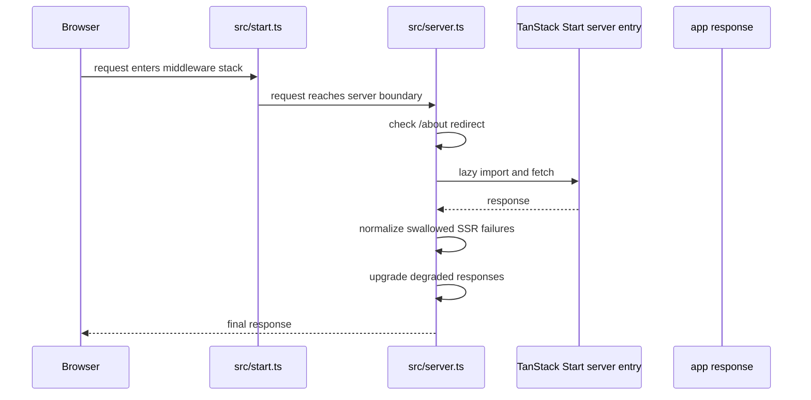

# Release and Runtime Operations

This page documents the commands and entrypoints that matter when you need to ship the app, preview a build, or debug runtime behavior. The goal is to use the narrowest verified step that proves the change you made actually reached the boundary you care about.

## What runs in production

The app is a TanStack Start application. `package.json` exposes the main lifecycle commands:

- `bun run dev` for local development
- `bun run build` for production builds
- `bun run preview` for previewing a built app

The Vite/TanStack config redirects the server entry to `src/server.ts`, so that file is the actual server boundary for SSR and request normalization.

## Request and server lifecycle

`src/start.ts` installs the request middleware stack. The order is important:

1. outer error handling
2. Clerk auth only when `CLERK_SECRET_KEY` exists
3. CSRF protection for server functions

That conditional auth behavior is operationally important: if `CLERK_SECRET_KEY` is absent, the app serves without sessions instead of failing the public site.

`src/server.ts` then handles the runtime request path after TanStack Start creates the server entry. It:

- lazily loads `@tanstack/react-start/server-entry`
- permanently redirects `GET` and `HEAD` requests for `/about` to `/who-we-are`
- normalizes a specific h3-swallowed SSR failure into the app's HTML error page
- upgrades degraded responses after that normalization step

The diagram shows the verified runtime order: middleware first, then the server wrapper, then the framework handler, then response normalization.

## Commands you can rely on

### Development

Use `bun run dev` for the local runtime. In the Playwright config, the dev server is started with `bunx vite dev` and `--strictPort` when the test base URL is localhost, which makes port collisions fail immediately instead of silently switching ports.

### Production build

Use `bun run build` to produce the production bundle.

The repository also exposes `bun run build:dev`, which builds in development mode.

### Preview

Use `bun run preview` to inspect a built output locally.

This is the right check when you want to confirm the build artifact behaves as expected without running the full development server.

## Narrowest validation that demonstrates a change

Choose the smallest command that exercises the layer you changed:

- UI or route rendering change: `bun run build` plus the relevant browser test
- server middleware or SSR change: `bun run build` and a runtime request against the affected path
- dev-server behavior: `bun run dev` or the Playwright web server path when debugging browser tests
- browser-flow regression: `bun run e2e`

The repository's browser gate is `bash scripts/verify/e2e.sh`. It does not trust a bare `playwright test` exit code alone. The script checks that the Playwright config exists, that the shared e2e base URL config exists, that the spec set is non-empty, that the `no-js` spec is present, and that Playwright is installed before delegating to `bunx playwright test`.

That extra preflight matters because Playwright exits 0 when it finds no tests, which would otherwise create a false green.

## Release and verification gates

Two verification scripts are important for release confidence:

- `bash scripts/verify/delta.sh` is the "no new breakage" gate. It requires the pinned ESLint and failing-test baselines, then runs `bun run scripts/verify/baseline.ts --check`.
- `bash scripts/verify/e2e.sh` is the browser-suite gate. It asserts that the suite really exists before running it.

Use the narrowest one that matches the risk:

- source-level regression checks: `verify:delta`
- browser behavior and no-JS coverage: `e2e`

## Operational invariants and failure modes

A few failure modes are intentional and should be preserved:

- Missing `CLERK_SECRET_KEY` disables auth rather than taking down public pages.
- A swallowed SSR error should become a legible HTML 500, not a hidden JSON body.
- `/about` is a permanent redirect only for `GET` and `HEAD`.
- Playwright should never be trusted if the suite is empty, because empty discovery can still exit 0.
- The Playwright web server uses `--strictPort` so a port clash fails immediately instead of silently moving the server.

Those invariants are what keep release debugging honest: the runtime either proves the change at the correct boundary, or it fails in a way that tells you where to look.

## Practical release sequence

A safe local-to-release flow is:

1. `bun run build`
2. `bun run preview` if you need to inspect the built app
3. `bun run e2e` for browser coverage when the change affects rendering or interaction
4. `bun run verify:delta` if you need the repository's no-new-breakage gate

If the change touches server behavior, verify the affected request path against the built output or the dev server before treating the release as ready.
