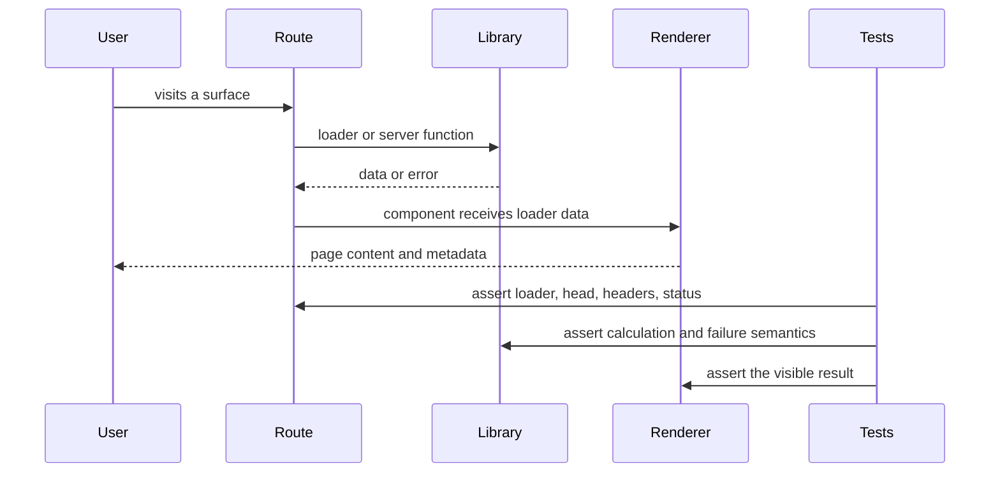
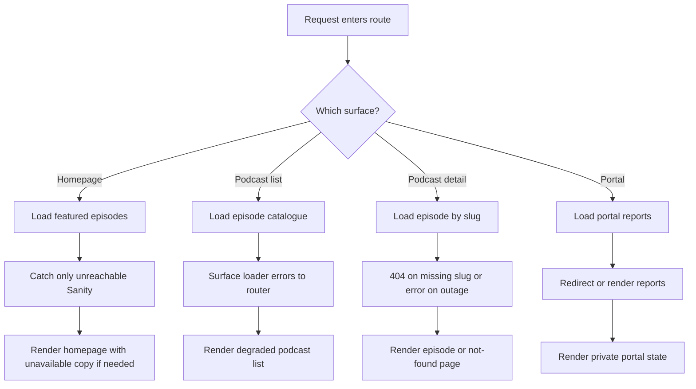

# Feature Change Workflow

This page describes the safest way to implement a typical product change in this codebase: trace the request from the route entrypoint, through shared calculation or fetch logic, into the renderer, and then update the tests that prove the behavior across those boundaries.

The repository is organized so that route files stay thin and delegate real work to shared modules:
- `src/routes/*.tsx` owns route wiring, loader choice, headers, head tags, and the final component.
- `src/lib/*.ts` and subdirectories own reusable calculation, content shaping, server functions, and other shared behavior.
- `e2e/*.spec.ts` checks end-to-end rendering and surface-level invariants across the built app.

## What to change first

When a feature request crosses systems, start by identifying the caller-to-calculator-to-renderer chain:
1. **Caller**: the route or page that receives the request.
2. **Calculator / fetcher**: the shared library function that derives the data or policy.
3. **Renderer**: the component that turns the result into UI.
4. **Tests**: the focused unit, route, and e2e checks that assert the intended behavior.

The route should usually remain a shell over shared logic. For example, the homepage route loads featured podcast data from `loadFeaturedEpisodes(fetchEpisodeList, 39)` rather than embedding the outage policy inline, and the route test verifies that the homepage stays up when podcast data is unavailable while still surfacing the degraded state in the page copy. The podcast listing route takes the opposite approach: it lets Sanity failures bubble so the router can treat them as genuine errors and render the degraded component instead of silently showing an empty catalogue. The portal route follows the same traceable pattern for authentication and access control, moving from `fetchPortalPage()` to a signed-in page that renders either reports or an empty state.

## The core implementation pattern

A safe feature change usually follows this sequence:

1. **Update or add shared logic in `src/lib/` first.**
   Put the invariant, query, or transformation where it can be tested independently.
2. **Wire the route to the shared logic.**
   Keep the route loader, headers, and head metadata aligned with the new behavior.
3. **Render only what the data supports.**
   Preserve existing fallbacks and avoid inventing content when fields are missing.
4. **Add tests at each boundary the change crosses.**
   If the change affects data loading, route status, navigation, or page content, update unit tests, route tests, and e2e coverage together.

This codebase uses the route layer to distinguish failure modes instead of collapsing them. The podcast episode route is the clearest example: the loader treats a missing episode as `notFound()`, but a real upstream failure is allowed to surface as an errored match so the page can report temporary unavailability accurately. Its head logic then branches on `match.status` so a genuine outage, a true 404, and a valid episode each produce different metadata.

## Traceable change flow

This flow is the standard change path for route-backed features: data should be traceable from the request to the calculation and then to the UI that consumes it.

## Where each system owns behavior

### Routes

Routes own:
- loader selection and data shape for the page
- `head()` metadata and social tags
- headers such as `noindex` or degraded-status markers
- the final React component and any local UI state

The homepage, podcast list, podcast episode page, and portal page all demonstrate that the route is where policy becomes visible. For example, the portal route sets both a `noindex` meta tag and `X-Robots-Tag: noindex`, because the whole surface is private. The podcast list route sets degraded headers only when the loader match is in an error state. The episode route uses route status to distinguish outage from not-found semantics before it chooses metadata.

### Shared libraries

Shared libraries own reusable and testable logic such as:
- Sanity query construction and server functions in `src/lib/podcast/queries.ts`
- homepage outage handling in `src/lib/podcast/featured.ts`
- client portal access and report loading in `src/lib/client-portal/portal.ts`
- surface declarations in `src/lib/surfaces.ts`

These modules are the right place for logic that would otherwise be duplicated across routes. `queries.ts` keeps the actual Sanity reads in one place and exports both plain async fetchers and `createServerFn` wrappers because route loaders may run in the browser during client navigation. `featured.ts` takes a fetch function as an argument so the narrow catch can be exercised in a test without depending on the server runtime. `portal.ts` similarly separates the pure decision path from the server wrapper so tests can pin redirect, token, and configuration behavior without Clerk.

### Tests

Tests should mirror the shape of the change:
- **Library tests** verify the pure calculation or branch logic.
- **Route tests** verify the route still wires the shared logic correctly and produces the right metadata, status, or fallback copy.
- **E2E tests** verify the whole surface still renders, navigates, and keeps the expected navigation structure.

The repository already uses this pattern:
- `src/routes/index.test.ts` checks the homepage loader’s narrow catch, the visible unavailable copy, and the fact that the route remains a thin shell over `loadFeaturedEpisodes`.
- `src/lib/podcast/featured.test.ts` proves the homepage helper returns featured episodes on success and only swallows Sanity-unreachable errors.
- `src/lib/client-portal/portal.test.ts` exercises redirect, token, config, and report-loading outcomes for the portal logic.
- `e2e/surfaces.spec.ts` visits every declared surface and verifies visible content, nav count, and image integrity.

## Control flow by surface

The key invariant is that each route handles only the failure mode it can honestly represent. A missing record is not the same thing as an outage, and a private page should not leak into public indexing.

## Configuration and operations considerations

If a feature change touches runtime behavior, also check the configuration and deployment contracts:
- Server functions and loaders depend on the runtime shape described in `src/lib/podcast/queries.ts` and `src/lib/client-portal/portal.ts`.
- The portal path depends on Clerk authentication and Supabase configuration, and its loader throws if the token or required env-backed config is missing.
- Podcast degradation uses explicit headers and retry values from `src/lib/podcast/degraded-status.ts`, so any change to temporary-unavailability behavior should update those expectations too.
- Public vs private indexing is encoded in route headers and head metadata, not in ad hoc robots rules elsewhere.

The operations docs for environment and runtime explain where configuration lives and how missing values fail. Use those expectations when deciding whether a change belongs in code, env config, or tests.

## Test update checklist for cross-system changes

When the change spans route, library, and UI, update the smallest set of tests that proves the whole path:
- add or revise a unit test for the shared calculation or fetch branch
- add or revise a route test for loader behavior, headers, metadata, or visible fallback copy
- add or revise an e2e test if the change affects a surface, navigation, or browser-visible invariant
- if the route list changes, make sure surface declarations and route-shape checks still agree

For example, a new public surface should update `src/lib/surfaces.ts`, the relevant route file, and `e2e/surfaces.spec.ts` together. A new podcast behavior may need both route coverage and library coverage, because the route loader and the helper it delegates to are intentionally separate.

## Practical rule

If you cannot trace the change from caller to shared logic to renderer, the change is probably in the wrong place. Move the invariant into a testable module, keep the route focused on orchestration, and make sure at least one test fails before the behavior change would become visible to users.
