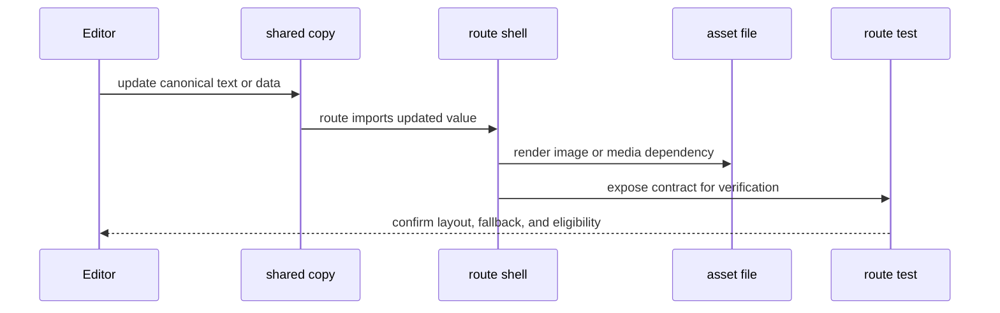

# Marketing and Content Change Workflow

This workflow describes how public-facing marketing copy moves through the repository. The key idea is that most visible pages are thin route shells, while the durable editorial state lives in shared content modules and a small set of assets. That separation keeps homepage, founder-story, manifesto, archive, and brand pages consistent while still letting each route own its layout and metadata.

## Surface boundaries

The public site is split between editorial surfaces and operational surfaces.

- **Editorial surfaces** are the marketing pages: `/`, `/why-we-exist`, `/who-we-are`, `/the-new-human-era`, `/the-human-archive`, `/about-the-founder`, and `/type-specimen`.
- **Operational surfaces** are data-driven experiences such as podcast and portal routes, plus route utilities like sitemap generation.

That split matters for content work because editorial pages should usually change through shared copy primitives, while operational pages are more constrained by loaders, auth, and external data contracts.

## Shared copy and brand sources

Brand and editorial copy is not duplicated across route files when the same text is reused.

- `src/lib/brand.ts` owns canonical brand strings and shared URLs such as `INDIGENOUS_LINE`, `CONTACT_EMAIL`, and `ARCHIVE_PLAYLIST_URL`.
- `src/lib/content.ts` owns reusable editorial sets such as `SERVICES`, `PRINCIPLE_TITLES`, `HOME_PRINCIPLES`, `ARCHIVE`, and `HUMAN_ARCHIVE_VIDEOS`.

This means the safe change pattern is:

1. Update the shared constant first.
2. Update every route that renders it.
3. Update or add the test that pins the expected content shape.

The shared-module approach is especially important for `PRINCIPLE_TITLES` and `HOME_PRINCIPLES`, because the manifesto page and homepage both consume the same six principles, and the copy is expected to stay aligned rather than drift into separate phrasings.

## Route responsibilities

Each editorial route owns a distinct surface contract.

### Homepage: `src/routes/index.tsx`

The homepage is the broadest marketing surface. It combines static hero content, shared principles, archive preview content, and featured podcast content.

Important responsibilities:

- renders the hero image from `src/assets/hero.png`
- consumes `HOME_PRINCIPLES` from `src/lib/content.ts`
- delegates featured podcast loading to `loadFeaturedEpisodes(fetchEpisodeList, 39)`
- degrades narrowly when Sanity is unreachable, rather than failing the whole page

This route is the most sensitive to content changes because it mixes brand narrative with operational podcast data. A static copy edit is usually safe; a loader or asset change can affect availability or visual hierarchy.

### Why We Exist: `src/routes/why-we-exist.tsx`

This route is an editorial essay. It is treated as a single continuous story, not as a modular landing page full of reusable marketing blocks.

Important responsibilities:

- keeps the article-like reading order intact
- uses a small number of images to support the narrative rather than turning into a gallery
- preserves prose fidelity against the source text checked by tests

The page is intentionally high-trust copy. Changes should be made carefully, because tests pin the prose much more tightly than they do for more modular pages.

### Who We Are: `src/routes/who-we-are.tsx`

This route is a concise team page built from shared team data.

Important responsibilities:

- renders `TEAM` from shared data instead of hardcoding member cards in the route
- keeps the surface intentionally small and linear
- exposes a founder profile link without adding a separate nested route tree

This page is an example of a reusable-section boundary: the route is responsible for layout and navigation behavior, while the content payload comes from the shared team module.

### The New Human Era: `src/routes/the-new-human-era.tsx`

This route is the manifesto page and is the strongest example of shared editorial primitives.

Important responsibilities:

- consumes `ARCHIVE` and `HOME_PRINCIPLES` from `src/lib/content.ts`
- uses a structural banding system to alternate cream and ink sections
- keeps imagery, quote insertion, and section composition aligned with the manifest-style layout

The page is designed around reusable section helpers rather than ad hoc JSX. That means a content edit often requires checking both the shared constants and the structural components that place them.

### The Human Archive: `src/routes/the-human-archive.tsx`

This route is a content gallery with a playback contract.

Important responsibilities:

- renders `HUMAN_ARCHIVE_VIDEOS` from `src/lib/content.ts`
- uses `ARCHIVE_PLAYLIST_URL` from `src/lib/brand.ts`
- mounts only one live YouTube player at a time
- destroys the iframe when the card is deactivated, rather than hiding it

This route is especially sensitive to asset and interaction changes, because the thumbnail, embedded player, and playlist CTA all depend on the same shared archive data.

### About the Founder: `src/routes/about-the-founder.tsx`

This route is the founder story page.

Important responsibilities:

- uses chapter-based alternating bands
- enforces prose fidelity against the source document
- relies on imported archival images and scans for supporting evidence rather than decorative repetition

It is an editorial page, but with a stronger document-like contract than most other routes. Its copy is largely fixed, so layout or emphasis changes should be made without rewriting meaning.

### Type specimen: `src/routes/type-specimen.tsx`

This route is not a user-facing marketing page, but it influences content workflows because it documents and validates the typography system used by the site.

Important responsibilities:

- records the live rendered type scale through computed styles
- is marked `noindex, nofollow`
- is excluded from the sitemap

When typography changes affect editorial pages, this route is the place where the new scale should be checked before rolling it across the public surfaces.

## Asset dependencies

Content changes often depend on assets as much as on copy.

- `src/assets/hero.png` supports the homepage hero.
- `src/assets/new-human-era-collage.png` supports the manifesto page.
- Archive and founder routes import their own story-specific images.
- The Human Archive page uses stills for cards and YouTube embeds for playback.

The practical rule is: if a page is visually anchored by a specific image, treat that asset as part of the content contract. Replacing the asset can change meaning, hierarchy, or legibility even when the text stays the same.

## Validation and route contracts

Tests and route contracts are what keep content changes safe.

- `src/routes/index.test.ts` pins the homepage fallback rule: Sanity outages are caught narrowly, real bugs are rethrown, and the front door should stay up.
- `src/routes/podcast.test.ts` and `src/routes/podcast_.$slug.test.ts` pin the opposite rule for podcast routes: they must fail loudly on real loader errors and preserve degraded-state signaling.
- `src/routes/sitemap.xml.test.ts` pins the public route inventory and keeps non-content surfaces like `/type-specimen` out of the sitemap.
- The route-shape and content-model tests described in the related pages ensure navigation, surfaces, and shared data stay aligned.

For marketing changes, these tests matter because they define where content can degrade gracefully and where it must remain explicit. Homepage content can fall back narrowly; manifesto and editorial pages should not silently invent content; private or operational surfaces must continue to obey their own contracts.

## Change workflow

A practical marketing/content edit usually follows this order:

1. Identify the surface and its contract.
2. Update the shared source of truth, if one exists.
3. Update the route to consume the new shared value.
4. Check whether the page depends on a reusable section component or helper.
5. Verify whether the page uses a required image or media asset.
6. Run the route- or content-specific tests that pin the change.

The safest edits are the ones that preserve the existing boundaries:

- route shells stay thin
- shared copy stays centralized
- assets remain tied to the right story surface
- tests describe the user-visible behavior, not just the file structure

## Extension points

When adding new marketing content, prefer one of these patterns:

- Add a new shared constant in `src/lib/brand.ts` or `src/lib/content.ts` if the text must be reused.
- Add a new route only when the page represents a distinct public surface.
- Reuse existing section helpers when the new content should match an established editorial pattern.
- Add a targeted test when the new content carries an invariant such as ordering, fallback behavior, or sitemap eligibility.

This flow shows the usual propagation path for marketing changes: edit shared content first, let routes compose it, and rely on tests to catch drift in layout, fallback behavior, and route eligibility.
